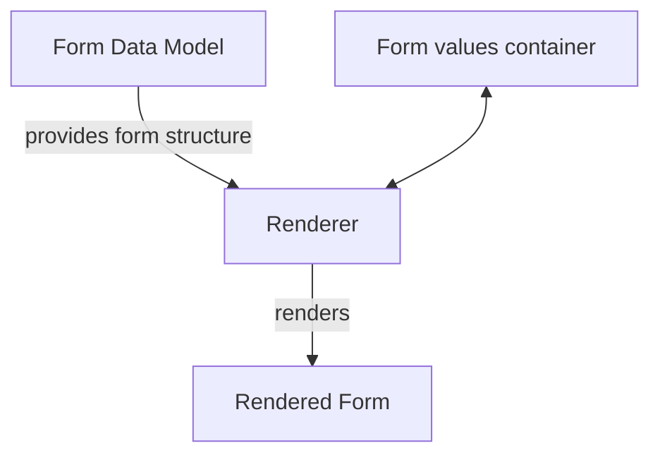

# iCure Form System

## Description

This is a form system for the iCure project. It is a web framework that allows users to create forms, fill them out, and view the results. The system is built using Lit framework to make it as light as possible and easy to integrate in any higher level framework.

## How to use

```bash
yarn add @icure/form
```

```javascript
import '@icure/form';
```

Inside your HTML file import a theme:

```html
import '@icure/form/themes/icure-blue';
```

and add the following tag:

```html
<icure-form
	.form="${this.form}"
	labelPosition="above"
	renderer="form"
	dafaultLanguage="en"
	.formValuesContainer="${this.formValuesContainer}"
	.optionsProvider="${this.optionsProvider}"
></icure-form>
```

## Data model

### Form

The Form class represents an entire form, encapsulating its metadata and structure, including sections and fields. It provides methods to parse form data from JSON and to serialize form instances back into JSON format.

#### Properties

- form: string - The title of the form.
- sections: Section[] - An array of sections that the form comprises.
- id: string - An optional identifier for the form.
- description: string - An optional description of the form.
- keywords: string[] - Optional keywords associated with the form.
- codifications: Codification[] - Optional codifications for the form.
- translations: TranslationTable[] - Optional translations for the form.

### Section

The Section class represents a section within a form. A section groups related fields together and can have its own metadata such as a title, description, and keywords.

#### Properties

- section: string - The title of the section.
- fields: Field[] - An array of fields, sub-forms and groups contained within the section.
- description: string - An optional description of the section.
- keywords: string[] - Optional keywords associated with the section.

### Field

The Field class represents a generic field within a form. It is designed to be extended by specific field types, each providing additional properties and behaviors.

#### Properties

- field: string - The type of the field.
- label: string - The label of the field.
- shortLabel: string - An optional short label for the field.
- grows: boolean - Optional property indicating if the field can grow vertically.
- span: number - Optional property indicating the lines span of the field.
- rowSpan: number - Optional property indicating the rows span of the field.
- tags: string[] - Optional tags associated with the field.
- codifications: string[] - Optional codifications for the field.
- readonly: boolean - Optional property indicating if the field is read-only.
- options: Record<string,unknown> - Optional field options.
- labels: Labels - Optional labels for the field.
- value: string - Optional value of the field.
- unit: string - Optional unit of the field.
- computedProperties: Record<string, string> - Optional computed properties for the field, any property of the field can be computed. A computed property will replace the value provided independently.
- validators: Validator[] - Optional validators for the field.
- translate: boolean - Optional property indicating if the field supports translation.
- width: number - Optional width of the field.
- styleOptions: { width: number, direction: string, span: number, rows: number, alignItems: string } - Optional style options for the field.

#### Implementations

The Field class has several specific implementations, each tailored to handle different types of input within a form. Here are the possible implementations:

- TokenField : a field that allows the user to handle a tokenized list of items.
- ItemsListField : a field that allows the user to handle a list of items.
- TextField : a very flexible field that allows the user to input a single line of text or to provide a fully customizable text editor with styling options.
- DateField : a field that allows the user to input a date (date pickers are supported)
- TimeField : a field that allows the user to input a time (time pickers are supported)
- DateTimeField : a field that allows the user to input a date and time (date-time pickers are supported)
- NumberField : a field that allows the user to input a number.
- MeasureField : a field that allows the user to input a number with a unit.
- DropdownField : a field that allows the user to select an option from a dropdown list.
- RadioButton : a field that allows the user to select an option from a list of radio buttons.
- CheckBox : a field that allows the user to select one or more options from a list of checkboxes.

### Codification

The Codification class represents a codification for a form or field. It is used to associate a code with a specific value, allowing for standardized data entry and analysis.
Commonly used codifications include ICD-10, ICPC-2, SNOMED-CT, and LOINC.
Codification systems can be specified at the form level but external codification providers can also be used.

### Translations

Translations can be provided at the form level or be provided by external translation providers.

## General architecture



The form is defined by a Form object that contains all the necessary information to represent the form. 
The renderer is responsible for rendering the form based on the form object. Several renderers can be implemented to render the form in different ways (e.g. as a web form, as a one section by page form (à la typeforms)).
The form values container is responsible for storing the values of the form. The form values container is immutable and can be modified by creating a new form values container with the desired modifications. 

### The form values container

All form value containers must implement a FormValuesContainer interface that declares the following methods:

- `compute(formula: string, sandbox?: S): T?` : computes a formula based on the values of the form, inside a provided sandbox. If no sandbox is provided, the default sandbox is used.
- `getLabel(): string` : returns the label of the form values container (used to display the title of the form in hierarchical contexts)
- `getFormId(): string?` : returns the id of the form values container
- `getValues(revisionsFilter: Lambda): VersionedData<Value>` : obtains the values to be displayed in the form, using a filter to select the desired versioned data that are to be displayed in a specific field.
- `getMetadata(id: string, revisions: (string | null)[]): VersionedData<Metadata>` : obtains the metadata of a specific value, for the specified revisions.
- `getValidationErrors(): [FieldMetadata, string][]`: returns the validation errors of the form values container for the values that are currently stored in it.
- `getChildren(): FormValuesContainer<Value, Metadata>[]` : returns the children of the form values container
- `setValue(label: string, language: string, data?: Value, id?: string, metadata?: Metadata): FormValuesContainerMutation<Value, Metadata, FormValuesContainer<Value, Metadata>, ID>` : modifies the value associated to a field in the form values container. As a form values container is immutable, this method returns a mutation wrapping a new form values container along with the modified value. 
- `setMetadata(label: string, metadata: Metadata, id?: string): FormValuesContainerMutation<Value, Metadata, FormValuesContainer<Value, Metadata>, ID>` : modifies the metadata associated to a value in the form values container. As a form values container is immutable, this method returns a mutation wrapping a new form values container along with the modified metadata.
- `delete(valueId: string): FormValuesContainerMutation<Value, Metadata, FormValuesContainer<Value, Metadata>, void>` : deletes a value from the form values container. As a form values container is immutable, this method returns a mutation wrapping a new form values container without the deleted value.
- `addChild(anchorId: string, templateId: string, label: string): Promise<FormValuesContainerMutation<Value, Metadata, FormValuesContainer<Value, Metadata>, FormValuesContainer<Value, Metadata>>>`: adds a child to the form values container. As a form values container is immutable, this method returns a mutation wrapping a new form values container with the added child.
- `removeChild(container: FormValuesContainer<Value, Metadata>): Promise<FormValuesContainerMutation<Value, Metadata, FormValuesContainer<Value, Metadata>, void>>` : removes a child from the form values container. As a form values container is immutable, this method returns a mutation wrapping a new form values container without the removed child.
- `registerChangeListener(listener: (newValue: FormValuesContainer<Value, Metadata>) => void): void` : registers a listener that will be called whenever the form values container is modified.
- `unregisterChangeListener(listener: (newValue: FormValuesContainer<Value, Metadata>) => void): void` : unregisters a listener that was previously registered.

It is very important to understand that the renderer has no knowledge of the inner-workings of the form values container. 
It only knows how to render the form based on the form object and the values that are stored in the form values container. 
The form values container is responsible for storing the values of the form and for providing the values to the renderer in a way that the renderer can understand, namely by providing values of the FieldValue type and metadata of the FieldMetadata type.

We cannot state enough how important it is to keep the form values container immutable. While this can seem cumbersome at first, it is a very powerful pattern that allows for easy undo/redo functionalities, easy state management, and easy debugging.
It also allows for optimisations as the values of the form values container can be reused in a new form values container if they have not changed.

It is also very important in the design to keep all code that is not under src/icure and src/conversion completely agnostic in terms of data model.
For example, it is not a good idea to make assumptions about the kind of data structure that are going to be available to the fields (like relying on it being a Service). 

### The renderer

The renderer is instantiated by the icure-form component and is responsible for rendering the form based on the form object and the form values container.

the icure-form component accepts the following properties:

- form: Form - the form object that represents the form to be rendered
- renderer: string - the name of the renderer to be used to render the form
- visible: boolean - a boolean indicating if the form should be visible or not
- readonly: boolean - a boolean indicating if the form should be read-only or not
- labelPosition: string - the favoured position of the labels in the form. This option can or cannot be honoured by the renderer.
- formValuesContainer: FormValuesContainer<FieldValue, FieldMetadate> : the form values container that contains the values of the form
- language: string - the language in which the form should be displayed
- optionsProvider: OptionsProvider - an optional provider that provides options for some fields of the form (like dropdown fields)
- translationsProvider: TranslationsProvider - an optional provider that provides translations for the form

### Themes 

Themes can be applied to renderers by importing one theme before importing/instantiating the icure-form component. 
The themes are located in the src/themes folder.

```javascript
import '../src/components/themes/icure-blue'
```


